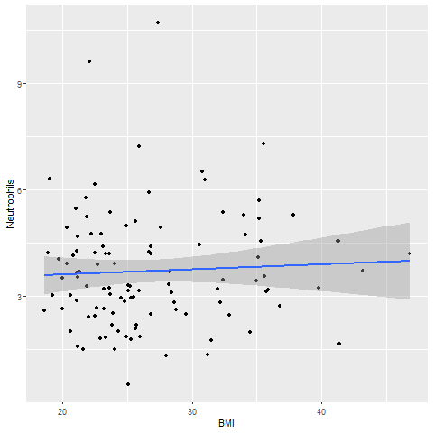
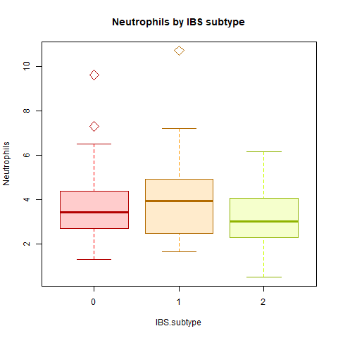
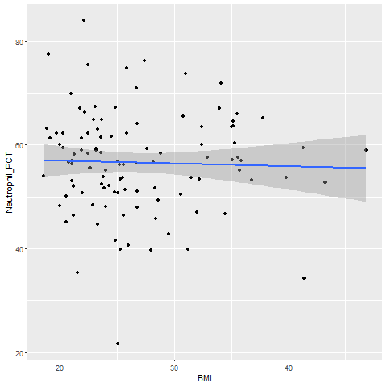
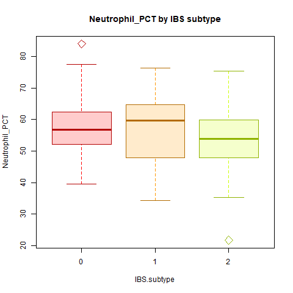

# <p align = "center">  Analyze Neutrophils and Analyze Neutrophils_PCT
### <p align = "center"> BTEC 330 Project-2 BY Titina Sirak
  
Neutrophils help to fight infections. If you have high Neutrophil levels, it tells your doctor you have inflammation or infection somewhere in your body. If it’s low, you could be at risk for infection. The normal range for Neutrophils is 1.6 to 7.0 cells per 1000 mm^3 of blood while, for Neutrophils_PCT is 34-71% per 1000 mm^3 of blood .

Data obtained from WebMD . (doi https://www.webmd.com/a-to-z-guides/complete-blood-count#1)

### Single regressions, ANOVA test, box-and-whiskers plot and scatterplots for clinical bloodwork 

([AnalyzeNeutrophils.R](../master/AnalyzeNeutrophils.R)) will allow you to load a comma-delimited .csv with various datapoints, perform single and multiple regressions of Body Mass Index (BMI) vs. Neutrophils and Neutropils_PCT from the Complete Blood Count with Differential (CBC-D) results, and produce 2-D scatterplots, one-way ANOVA with IBS-subtype as Independent Variable (X), and Neutrophils as Dependent Variable (Y). The output includes results of ANOVA test, a formatted box-and-whiskers plot and  and a formatted scattered plot.

Data (RobinsonEtAl_Sup1.csv) was downloaded from: 
Robinson, JM. et al. 2019. Complete blood count with differential: An effective diagnostic for IBS subtype in the context of BMI? BioRxiv. (doi: https://doi.org/10.1101/608208)

#### NOTE: Before runing the R script, make sure to set your working directory by using 'setwd()' command.

##
# Analyze Neutrophils
##### Install necessary packages
```
install.packages("ggplot2")

library(ggplot2)
```
##### Read data
```
IBS <- read.csv("data/RobinsonEtAl_Sup1.csv", header = TRUE)

head(IBS)

write.csv(IBS, "data_output/Neutrophils.csv")
```
######  Single Regressions 
######  Data obtained from Robinson, et al. 2019 (doi: https://doi.org/10.1101/608208)
######  https://statquest.org/2017/10/30/statquest-multiple-regression-in-r/
######  http://www.sthda.com/english/articles/40-regression-analysis/167-simple-linear-regression-in-r/
######  http://r-statistics.co/Linear-Regression.html

##### Single Regression Test, BMI vs. Neutrophils
```
Neutrophils.regression <- lm(BMI ~ Neutrophils, data = IBS)

summary(Neutrophils.regression)
```

##### Output the results to a file
###### Data obtained from doi: http://www.cookbook-r.com/Data_input_and_output/Writing_text_and_output_from_analyses_to_a_file/
```
sink('data_output/Neutrophils_regression.txt', append = TRUE)

print(Neutrophils.regression)

sink()

df<-na.omit(data)
```

##### ANOVA: IBS-subtype vs. Neutrophils
###### Data obtained from doi: http://www.sthda.com/english/wiki/one-way-anova-test-in-r
```
Neutrophils.aov <- aov(Neutrophils ~ IBS.subtype, data = IBS)

summary(Neutrophils.aov)

sink('data_output/Neutrophils_anova.txt', append = TRUE)

print(Neutrophils.aov)

sink()
```
##### Scatterplots
###### Data obtained from doi: http://www.sthda.com/english/wiki/ggsave-save-a-ggplot-r-software-and-data-visualization
https://www.statmethods.net/graphs/scatterplot.html

```
ggplot(IBS, aes(x = BMI, y = Neutrophils)) +
  geom_point(na.rm=TRUE) +    
  geom_smooth(method = lm,na.rm=TRUE)

 https://www.stat.berkeley.edu/~s133/saving.html

dev.copy(png,"fig_output/Neutrophils_scatterplot.png")

dev.off()

Neutrophils_scatterplot <- ggplot(IBS, aes(x = BMI, y = Neutrophils)) +

geom_point(na.rm=TRUE) +    

geom_smooth(method = lm,na.rm=TRUE)
  
```

##

##### Box plots
###### Data obtained from doi: https://www.statmethods.net/graphs/boxplot.html
##### https://tomizonor.wordpress.com/2013/04/18/color-boxplot/
 ```
c1 <- rainbow(10)

c2 <- rainbow(10, alpha=0.2)

c3 <- rainbow(10, v=0.7)

boxplot(Neutrophils ~ IBS.subtype, data = IBS, main="Neutrophils by IBS subtype", 
                       xlab = "IBS.subtype", ylab = "Neutrophils", col=c2, medcol=c3, whiskcol=c1, staplecol=c3, boxcol=c3, outcol=c3, pch=23, cex=2)

dev.copy(png,"fig_output/Neutrophils_boxplot.png")

dev.off()

```

##

##### Assign "HIGH", "NORMAL", or "LOW" based on clinical range to the Neutrophils_result parameter
```
IBS <- read.csv("data/RobinsonEtAl_Sup1.csv", header = TRUE)

IBS$Neutrophils_result <- "NA"

IBS$Neutrophils_result[IBS$Neutrophils > 7.0] <- "HIGH"

IBS$Neutrophils_result[IBS$Neutrophils <= 7.0 & IBS$Neutrophils >= 1.6] <- "NORMAL"

IBS$Neutrophils_result[IBS$Neutrophils < 1.6] <- "LOW"

write.csv(IBS, "data_output/Neutrophils.csv")
```


##
##


##
# Analyze Neutrophils_PCT
##### Install necessary packages
```
install.packages("ggplot2")

library(ggplot2)
```
##### Read data
```
IBS <- read.csv("data/RobinsonEtAl_Sup1.csv", header = TRUE)

head(IBS)

write.csv(IBS, "data_output/Neutrophils_PCT.csv")
```
######  Single Regressions 
######  Data obtained from Robinson, et al. 2019 (doi: https://doi.org/10.1101/608208)
######  https://statquest.org/2017/10/30/statquest-multiple-regression-in-r/
######  http://www.sthda.com/english/articles/40-regression-analysis/167-simple-linear-regression-in-r/
######  http://r-statistics.co/Linear-Regression.html

##### Single Regression Test, BMI vs. Neutrophils_PCT
```

Neutrophils_PCT.regression <- lm(BMI ~ Neutrophils_PCT, data = IBS)

summary(Neutrophils_PCT.regression)
```

##### Output the results to a file
###### Data obtained from doi: http://www.cookbook-r.com/Data_input_and_output/Writing_text_and_output_from_analyses_to_a_file/
```
sink('data_output/Neutrophils_PCT_regression.txt', append = TRUE)

print(Neutrophils_PCT.regression)

sink()

df<-na.omit(data)
```

##### ANOVA: IBS-subtype vs. Neutrophils_PCT
###### Data obtained from doi: http://www.sthda.com/english/wiki/one-way-anova-test-in-r
```
Neutrophils_PCT.aov <- aov(Neutrophils_PCT ~ IBS.subtype, data = IBS)

summary(Neutrophils_PCT.aov)

sink('data_output/Neutrophils_PCT_anova.txt', append = TRUE)

print(Neutrophils_PCT.aov)

sink()
```
##### Scatterplots
##### Print scatterplot and box plots as .png files into "fig_output" project directory.
###### Data obtained from doi: http://www.sthda.com/english/wiki/ggsave-save-a-ggplot-r-software-and-data-visualization
https://www.statmethods.net/graphs/scatterplot.html

```
ggplot(IBS, aes(x = BMI, y = Neutrophils_PCT)) +
  geom_point(na.rm=TRUE) +    
  geom_smooth(method = lm,na.rm=TRUE)

 https://www.stat.berkeley.edu/~s133/saving.html

dev.copy(png,"fig_output/Neutrophils_PCT_scatterplot.png")

dev.off()

Neutrophils_PCT_scatterplot <- ggplot(IBS, aes(x = BMI, y = Neutrophils_PCT)) +

geom_point(na.rm=TRUE) +    

geom_smooth(method = lm,na.rm=TRUE)
  
```

##

##### Box plots
###### Data obtained from doi: https://www.statmethods.net/graphs/boxplot.html
##### https://tomizonor.wordpress.com/2013/04/18/color-boxplot/
 ```
c1 <- rainbow(10)

c2 <- rainbow(10, alpha=0.2)

c3 <- rainbow(10, v=0.7)

boxplot(Neutrophils_PCT ~ IBS.subtype, data = IBS, main="Neutrophils_PCT by IBS subtype", 
                       xlab = "IBS.subtype", ylab = "Neutrophils_PCT", col=c2, medcol=c3, whiskcol=c1, staplecol=c3, boxcol=c3, outcol=c3, pch=23, cex=2)

dev.copy(png,"fig_output/Neutrophils_PCT_boxplot.png")

dev.off()

```

##

##### Assign "HIGH", "NORMAL", or "LOW" based on clinical range to the Neutrophils_PCT_result parameter
```
IBS <- read.csv("data/RobinsonEtAl_Sup1.csv", header = TRUE)

IBS$Neutrophils_PCT_result <- "NA"

IBS$Neutrophils_PCT_result[IBS$Neutrophils_PCT > 7.0] <- "HIGH"

IBS$Neutrophils_PCT_result[IBS$Neutrophils_PCT <= 7.0 & IBS$Neutrophils_PCT >= 1.6] <- "NORMAL"

IBS$Neutrophils_PCT_result[IBS$Neutrophils_PCT < 1.6] <- "LOW"

write.csv(IBS, "data_output/Neutrophils_PCT.csv")
```


##
##

# <p align = "center"> BTEC395 PROJECT
# <p align = "center"> Data Transformation and Volcano Plots
  
  #### NOTE: Before runing the R script, make sure to set your working directory by using 'setwd()' command.
  
  ###### Data obtained from  Robinson, et al. 2019, BioStars, R-Bloggers, Data Analytics, StatMethods, YouTube, Science Matters.
  
  ### Discription About the project 
  NeutrophilFinalProject.R project will familiarize you with tasks necessary to produce differential expression results and a corresponding volcano plot. These tasks include transforming data, handling data in R including extracting statistical results, combining rows and columns, writing FOR loops and IFELSE commands, and intermediate features of ggplot2. You will become familiar with interpretation of volcano plots for displaying differential expression results


##### Read in the table of fold changes
```
FCdata <- read.csv("../data/FCNeutrophil.csv", row.names = 1, header = FALSE)
```
##### Read in the table of expression data
```
IBS <- read.csv("../data/GXdata.csv", header = TRUE)
```

##### Access only the columns with RNA Expression (subsetting)
```
names(IBS)[28:277]
```

##### Make a list of anova(lm()) results for neutrophil
```
storage <- list()

for(i in names(IBS)[28:277]){
  storage[[i]]  <- anova(lm(get(i) ~ NeutrophilPCT, IBS))
}
```

##### Extract the NeutrophilPCT p-values into a new list
```
pVals <- list()

for(i in names(storage)){
  pVals[[i]] <- -(log10(storage[[i]]$'Pr(>F)'))
}
```

##### Convert the pValues list into a data frame. 
```
DFpvalues <- data.frame(matrix(unlist(pVals), nrow=length(pVals), byrow=T))
```
##### Combine the results dataframes and write column labels: NeutrophilPCT 
```
VolcanoPlotData <- cbind(FCdata, DFpvalues)
names(VolcanoPlotData)[1] <- paste("log2(SlopeDiff)")
names(VolcanoPlotData)[2] <- paste("-log10(Pval)")
```
##### Add a column to evaluate significance
```
VolcanoPlotData$Sig <- ifelse(VolcanoPlotData$`-log10(Pval)` > 1.3, "Sig", "Insig");
``` 

##### Install necessary packages
```
install.packages("ggplot2")
library(ggplot2)
library(ggrepel)
```

#####  Output the result of the NeutrophilPCT volcano plot into Fig_Output folder
```
png("../fig_output/NeutrophilPCTplot.png")
NeutrophilPCTplot <- ggplot(VolcanoPlotData, aes(x = `log2(SlopeDiff)`, y = `-log10(Pval)`, label=rownames(VolcanoPlotData), color=Sig)) +
  geom_point(aes(color = Sig)) +
  scale_color_manual(values = c("grey", "red")) +
  theme_bw(base_size = 12) + theme(legend.position = "bottom") +
  geom_text(aes(x = `log2(SlopeDiff)`,y = `-log10(Pval)`, fontface = 1, size=3,  label=row.names(VolcanoPlotData)))
  

print(NeutrophilPCTplot + ggtitle("Gene Expression vs. NeutrophilPCT Level"))
dev.off()
```
##
```
### <p align = "center"> Volcano Plot </p>

<p align="center">
   
```   


### List of all diffrentially expressed/ significant genes 

|***GENE***|***ALIAS***|
|:--:|:-------|
|**EWSR1**|EWS RNA Binding Protein 1|
|**Klf7**|Kruppel Like Factor 7|
|**Cd300lb**|member b is a protein|
|**CD28**|Cluster of Differentiation 2|
|**CD3G**|T-cell surface glycoprotein CD3 gamma chain|
|**EWSR1**|EWS RNA Binding Protein 1|
|**MSR1**|Macrophage Scavenger Receptor 1|
|**TLR4**|Toll-like receptor 4|

  
  

